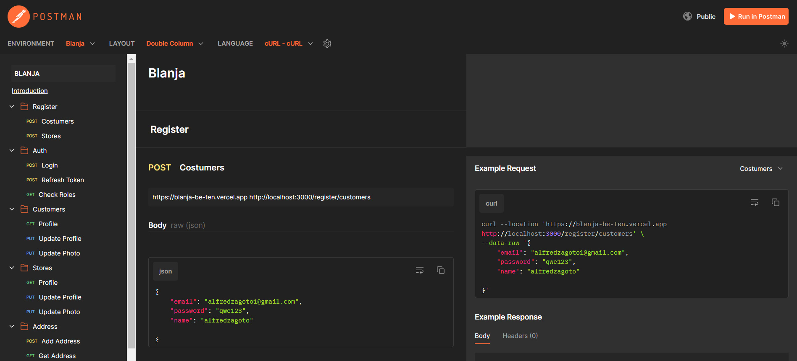

<p align="center">
  
</p>

<h1 align="center">
  <a href="https://git.io/typing-svg">
    
  </a>
</h1>

Welcome to Blanja, your premier destination for all things e-commerce. Blanja offers a seamless and secure online shopping experience, providing a wide range of products to cater to every need and preference.

## Tech Stack

**Programming language:** JavaScript (Node JS)

**Framework:** Express JS

**Database:** PostgreSQL

**API Testing:** Postman

**Authentication:** JWT (JSON Web Tokens)

[](https://skillicons.dev)

## Features

⚡ Users can create customer and seller accounts

⚡ Users can edit their profiles (customer or seller)

⚡ customers can view products by category

⚡ customers can add, update, delete their address

⚡ seller can add, update, and delete their products

## Project Structure

```
└── 📁blanja-be
    └── .env
    └── .eslintrc.json
    └── .gitignore
    └── 📁assets
        └── image.png
        └── logo-readme.png
    └── eslint.config.mjs
    └── index.js
    └── package-lock.json
    └── package.json
    └── README.md
    └── 📁src
        └── 📁configs
            └── cloudinary.js
            └── db.js
        └── 📁controllers
            └── address.js
            └── auth.js
            └── customers.js
            └── orders.js
            └── products.js
            └── stores.js
            └── upload.js
        └── 📁helper
            └── auth.js
            └── common.js
        └── 📁middlewares
            └── auth.js
            └── upload.js
        └── 📁models
            └── address.js
            └── auth.js
            └── customers.js
            └── orders.js
            └── products.js
            └── stores.js
        └── 📁routes
            └── address.js
            └── auth.js
            └── customers.js
            └── order.js
            └── products.js
            └── register.js
            └── stores.js
            └── upload.js
    └── vercel.json
```

## Installation

#### Clone this repository :

```bash
  git clone https://github.com/naufandarmawan/blanja-be
```

#### Install Module on Project Directory :

```bash
  npm install
```

#### Start the project :

```bash
  npm run dev
```

## Environment Variables

To run this project, you will need to add the following environment variables to your .env file

data base server credentials:

`PG_USER`

`PG_PASSWORD`

`PG_HOST`

`PG_DATABASE`

`PG_PORT`

`PORT`

`SECRET_KEY_JWT`

cloudinary credentials:

`CLOUD_NAME`

`API_KEY`

`API_SECRET`

## Postman Documentation

[](https://documenter.getpostman.com/view/33569453/2sA3JT4eB9)



## Related Project

⚡[Blanja Backend Demo](https://blanja-be-ten.vercel.app/)  

⚡[Blanja Frontend Demo](https://blanja-fe-xi.vercel.app/)

⚡[Blanja Frontend Repository](https://github.com/naufandarmawan/blanja-fe)

## Developed by the FWM19 Team :

💻 [@anditorp](https://github.com/anditorp) as Backend Developer

💻 [@SwitchZer](https://github.com/SwitchZer) as Backend Developer

💻 [@crossxjonathan](https://github.com/crossxjonathan) as Frontend Developer

💻 [@naufandarmawan](https://github.com/naufandarmawan) as Frontend Developer

## License

Distributed under the MIT License. See <a href="https://github.com/naufandarmawan/blanja-be/blob/master/LICENSE">`LICENSE`</a> for more information.

<p align="right">(<a href="#readme-top">back to top</a>)</p>
